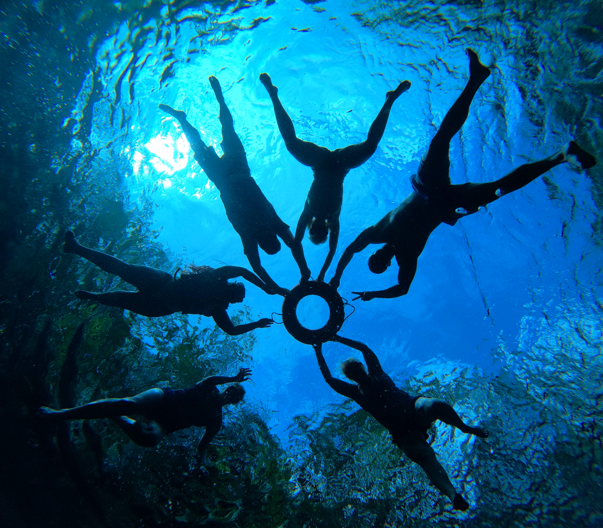
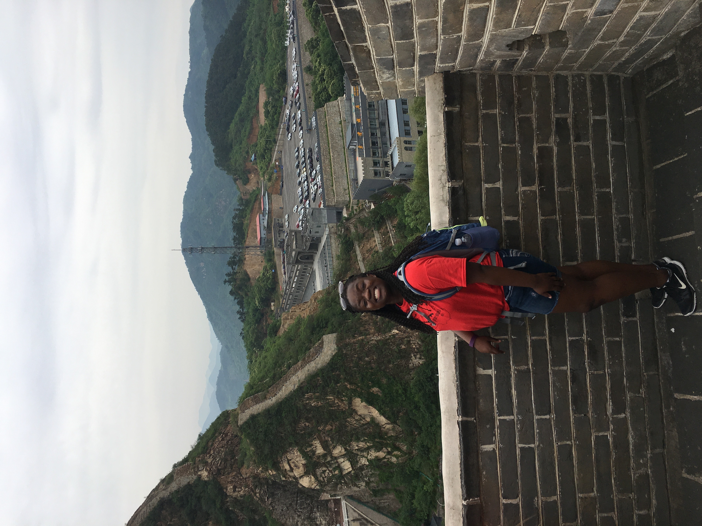

------------------------------------------------------------------------

## [HOME](http://Rosiek032123.github.io/) \| [ABOUT ME](http://Rosiek032123.github.io/About_me/) \| [CV](http://Rosiek032123.github.io/CV/RosemarieKent-4.pdf) \| [PORTFOLIO](http://Rosiek032123.github.io/Portfolio/)

# About me

Welcome! I'm delighted to share a glimpse into my world. My name is Rosemarie Kent, though you can simply call me Rosie. As a Haitian adoptee who found solace and purpose in the welcoming embrace of Utah, I've embarked on a journey of discovery and impact.

```{r out.width="30%", echo=FALSE, fig.align='left'}

```

At Utah Valley University, I'm deeply engrossed in the captivating realm of Statistics, driven by a fervent desire to harness the power of data to craft compelling narratives. For me, statistics isn't just a subject—it's a passion that fuels my commitment to understanding our world and effecting positive change.

With over three years of hands-on experience in R, I've spearheaded numerous projects, each a testament to my dedication and expertise in data analysis. On my portfolio page, you'll find a showcase of these endeavors, illustrating my proficiency and insights.

Currently, I'm on a dual learning journey, expanding my skill set with MySQL and Python. As a Data Science Intern at the UVU BRC, I leverage these newfound skills to serve our community, employing data-driven approaches to tackle real-world challenges and drive meaningful change.

But life isn't just about data and statistics. Beyond my academic pursuits, you'll find me indulging in my other passions. Whether it's penning verses of poetry, exploring the breathtaking Mexico, China, and Utah, or immersing myself in the gripping narratives of thrilling novels or historical fiction, I find joy in every moment.

```{r,out.width="30%", echo=FALSE}


```

On track to graduate Summa Cum Laude in August 2024, I'm eagerly anticipating the journey ahead. Join me as I continue to unravel the mysteries of data and contribute to a brighter, more equitable world.
