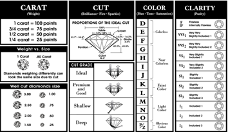

### To see the code behind this analysis please click on this [link](http://Rosiek032123.github.io/Portfolio/Biol_3100_Final_Project/Final-Project.html).

# Introduction

Diamond Prices can be impacted by various things, such as inflation, carat, etc. I will be examining a data set with 53,943 diamonds which includes the variables, carat, cut, color, clarity, x, y, z, depth, table, and price. The images below give a visual explanation of each variable.
```{r,out.width="60%", echo=FALSE}

knitr::include_graphics("./images/Unknown.jpeg")
```

The purpose of this analysis is to answer the following questions:

Are all the variables in this data set important in explaining diamond prices? If, not which variables are important?

Is there an interaction between diamond clarity and carat weight?

Does the fitted model explain diamond prices well?

The scatter plot of the price against doesn’t appear to follow a linear pattern. This would require a transformation to make the data follow a linear trend. I will transform my data by examining both price and carat on a log scale. After transforming the data, the scatter plot follows a more linear pattern.

There is not an interaction between diamond clarity and carat weight. If there was an interaction, I would be able to assign different slopes for each clarity level.

The equation for our current model is. 

$$Y=\beta_0+\beta_1x_1+\beta_2x_2+\beta_3x_3+\beta_4x_4+\beta_5x_5+\beta_6x_6+\gamma_1G_1+\gamma_2G_2+\gamma_3G_3+\gamma_4G_4+\gamma_5G_5+\gamma_6G_6+\delta_1H_1+\delta_2H_2+\delta_3H_3+\delta_4H_4+\delta_5H_5+\delta_6H_6+\delta_7H_7+\zeta_1J_1+\zeta_2J_2+\zeta_3J_3+\zeta_4J_4+\varepsilon$$

Y: Actual log(diamond price)

$\beta_0$: When all other values are at zero the log(price) of a fair cut, J color, I1 clarity diamond is $\beta_0$ after adjusting for log(carat).

$\beta_1$: On average, holding all other variables constant there is a $\beta_1$ change in log(price) for every 1 unit increase in log(carat).

$\beta_2$: On average, holding all other variables constant there is a $\beta_2$ change in log(price) for every 1 unit increase in depth.

$\beta_3$: On average, holding all other variables constant there is a $\beta_3$ change in log(price) for every 1 unit increase in table.

$\beta_4$: On average, holding all other variables constant there is a $\beta_4$ change in log(price) for every 1 unit increase in x variable.

$\beta_5$: On average, holding all other variables constant there is a $\beta_5$ change in log(price) for every 1 unit increase in y variable.

$\beta_6$: On average, holding all other variables constant there is a $\beta_6$ change in log(price) for every 1 unit increase in z variable.

$\gamma_1$: Measures the differential log(price) for diamonds in the I color group relative to countries in the J color group after adjusting for log(carat).

$\gamma_2$: Same as $\gamma_1$ but for color group H.

$\gamma_3$: Same as $\gamma_1$ but for color group G.

$\gamma_4$: Same as $\gamma_1$ but for color group F.

$\gamma_5$: Same as $\gamma_1$ but for color group E.

$\gamma_6$: Same as $\gamma_1$ but for color group D.

$\delta_1$: Measures the differential log(price) for diamonds in the SI2 clarity group relative to diamonds in the I1 clarity group after adjusting for log(carat).

$\delta_2$: Same as $\delta_1$but for clarity group SI1.

$\delta_3$: Same as $\delta_1$ but for clarity group VS2.

$\delta_4$: Same as $\delta_1$ but for clarity group VS1.

$\delta_5$: Same as $\delta_1$ but for clarity group VVS2.

$\delta_6$: Same as $\delta_1$ but for clarity group VVS1.

$\delta_7$: Same as $\delta_1$ but for clarity group IF.

$\zeta_1$: Measures the differential log(price) for diamonds in the “good” cut group relative to diamonds in the fair cut group after adjusting for log(carat).

$\zeta_2$: Same as $\zeta_1$ but for cut group “very good.”

$\zeta_3$: Same as $\zeta_1$ but for cut group “premium.”

$\zeta_4$: Same as $\zeta_1$ but for cut group “fair.”

$$
G_{ti} = 
\left\{
\begin{array}{ll}
      1 & \text{if } t^{\text{th}} \text{ diamond is in } i^{\text{th}} \text{ color group} \\
      0 & \text{otherwise}
\end{array} 
\right.
$$

$$
H_{ti} = 
\left\{
\begin{array}{ll}
      1 & \text{if } t^{\text{th}} \text{ diamond is in } i^{\text{th}} \text{ clarity group} \\
      0 & \text{otherwise}
\end{array} 
\right.
$$

$$
J_{ti} = 
\left\{
\begin{array}{ll}
      1 & \text{if } t^{\text{th}} \text{ diamond is in } i^{\text{th}} \text{ cut group} \\
      0 & \text{otherwise}
\end{array} 
\right.
$$

$$
\varepsilon \sim N(0, \sigma^2)
$$

I used the standard residual plot to locate the outliers in the data. I removed any outlier that was greater than 3 or less than -3. After remove the outliers I checked the regression assumptions using the residual plot, qq-plot, and density plot. Based on the residual plot the equal variances assumption appears to be met. The density plot is approximately normal, and the qq-plot is approximately with a few points that go briefly outside the error bands.

The regression analysis found that the variables y, z, and table are not significant. I removed those form the model. The new fitted model for the data after the non-significant variables and outliers are removed is:

$\hat{Y} = 6.2998516 + 1.6608091x_1 + 0.0046321x_2 + 0.1192737x_3 + 0.1410619G_1 + 0.2661374G_2 + 0.3585841G_3 + 0.4244583G_4 + 0.4655162G_5 + 0.5171887G_6 + 0.4042847H_1 + 0.5714248H_2 + 0.7196982H_3 + 0.7905746H_4 + 0.9228387H_5 + 0.9930853H_6 + 1.0772293H_7 + 0.0879206J_1 + 0.1232452J_2 + 0.1424553J_3 + 0.1654542J_4$

The $R^2$after transforming back to the original data is 0.9644476.

Almost 97% of variability in the log of diamond prices can be explained by the five variables in our model. This means our model is great at explaining variation in the log of diamond prices.

Now that the analysis is complete, the research questions have been answered below.

Are all the variables in this data set important in explaining diamond prices? If, no which variables are important? Based on the summary of the regression model we see that cut, color, clarity, depth, log(carat) and x have a significant impact on predicting diamond log(prices). Is there an interaction between diamond clarity and carat weight? Based on the initial box plots it can be determined that there is not a significant interaction between clarity and log(carat). This was surprising as I believe most people would think that clarity would interact in a significant way with carat weight. Does the fitted model explain variability in diamond prices well? The fitted model has an r-squared value of about .97. This means that our model explains about 97% of variability in the log of diamond prices.
