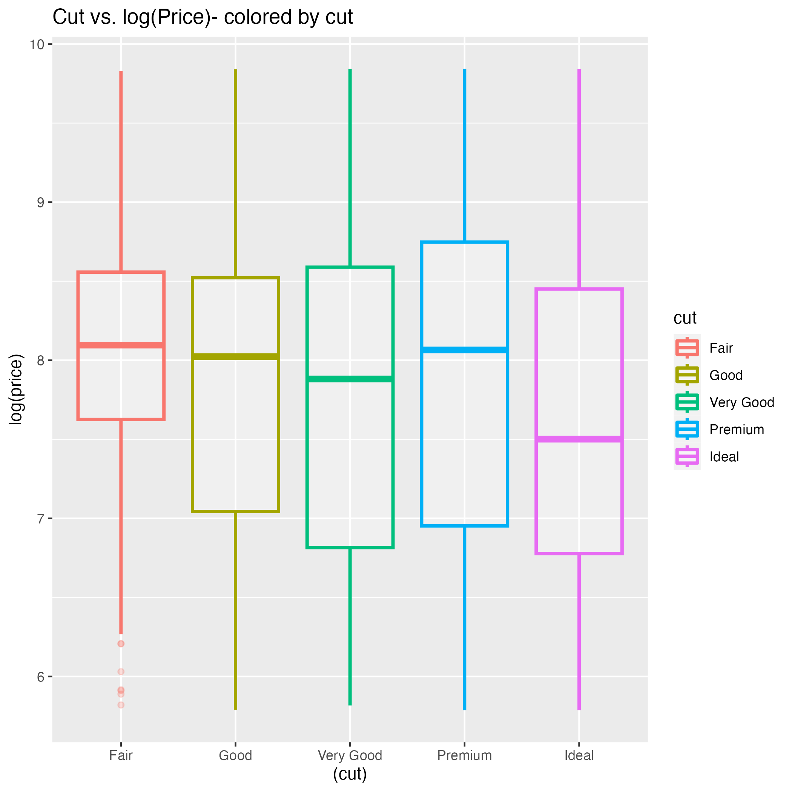
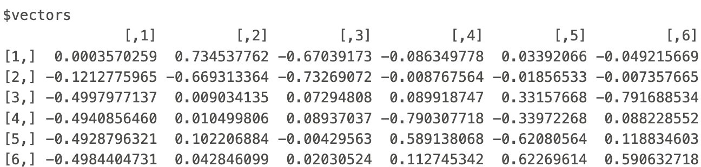
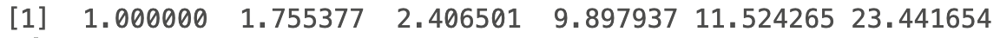
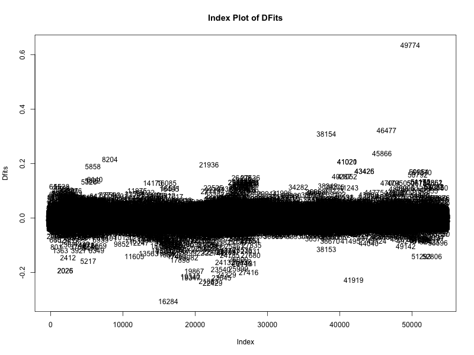
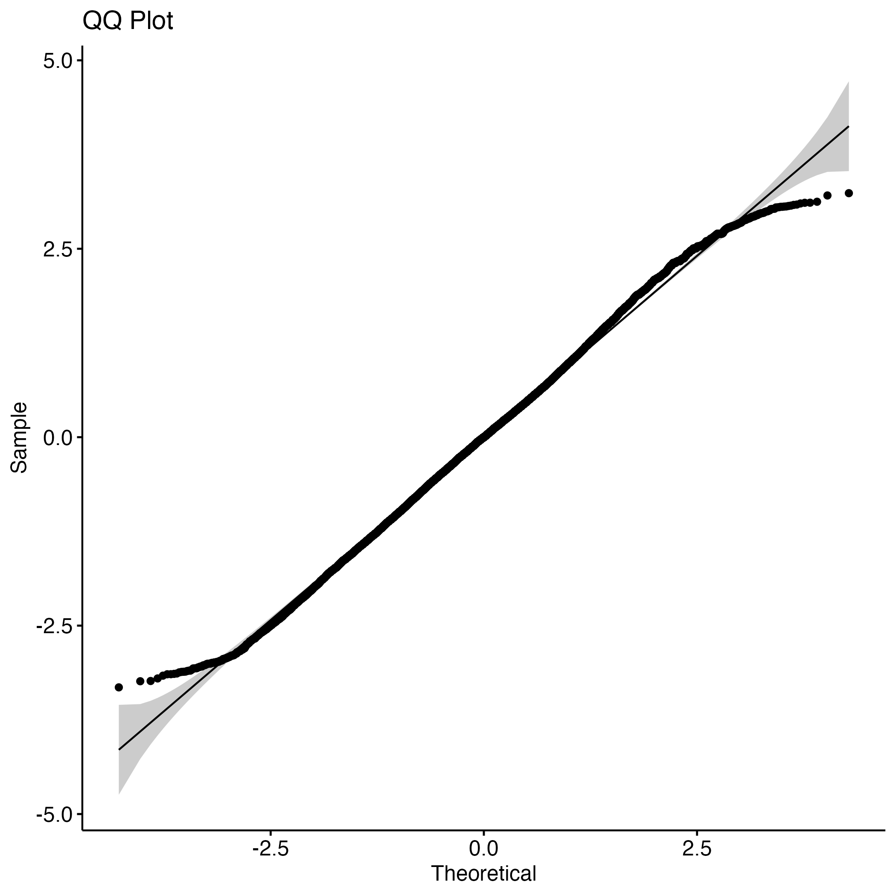
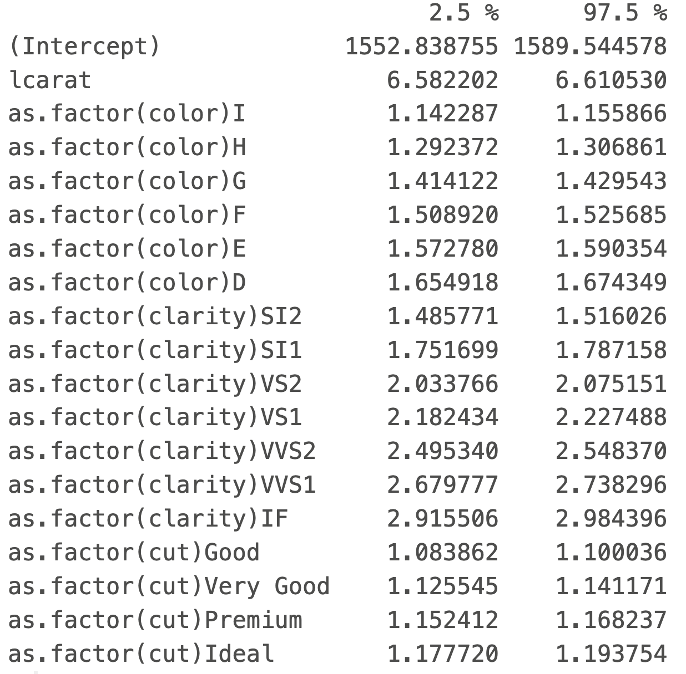

### To see the code behind this analysis please click on this [link](http://Rosiek032123.github.io/Portfolio/Biol_3100_Final_Project/Final-Project.html).

# Introduction

Diamond Prices can be impacted by various things, such as inflation, carat, etc. I will be examining a data set with 53,943 diamonds which includes the variables, carat, cut, color, clarity, x, y, z, depth, table, and price. The images below give a visual explanation of each variable.

```{r,out.width="60%", echo=FALSE, fig.align='center'}


```

# Objectives

The purpose of this analysis is to answer the following questions:

1.     Are all the variables in this data set important in explaining diamond prices? If, not which variables are important?

2.     Is there an interaction between diamond clarity and carat weight?

3.     Does the fitted model explain diamond prices well?

4.     What are the differences in prediction intervals and confidence intervals, for diamonds of different carat weights, with the best cut, least amount of color, and highest amount to clarity?

# Exploratory Analysis

The scatterplot of the price against carat doesn’t appear to follow a linear pattern. This would require a transformation to make the data follow a linear trend. I will transform my data by examining both price and carat on a log scale. After transforming the data, the scatterplot follows a more linear pattern. Based on the scatter plot here is not an interaction between diamond clarity and carat weight. If there was an interaction, I would be able to assign different slopes for each clarity level.

```{r,out.width="60%", echo=FALSE, fig.align='center'}

knitr::include_graphics(c("./images/1.png","./images/2.png"))

```

Using boxplots I checked if there is a constant effect on log of price due to clarity, color, or cut. On the color versus log of price boxplot the median price seems to decrease as the diamonds move towards D which is a practically colorless diamond level. The same trend happens in the clarity versus log of price boxplots. The cut versus log of price graph shows that the boxplot as have different median prices depending on cut. It may be possible to remove an indicator for cut, but due to the fair cut begin significantly different from the others and different cuts being an important factor to many diamond experts I included cut as an idicator variable. Since none of the other boxplots for clarity and color seem to have a constant effect, I will include indicator variables for those as well.This choice to include indicator variable is further confirmed by the scatterplots for carat and price on a log scale colored by cut, clarity or color. Each of these scatterplots seems to have at least two distinct clusters for each claraity, cut or color.

```{r,out.width="60%", echo=FALSE, fig.align='center'}





```

I constructed a scatterplot matrix of my numerical variables to check for collinearity. Based on the high R-squared values I suspect there may be collinearity in variables x, y, z, and log of carat. I used VIF, eigenvalues, and eigenvectors to find where the collinearity lied. The log of carat, x, y, and z all had VIF values larger then 10, this means there is collinearity. The condition index for K6 had a value greater than the threshold of 15. I went to the 6th eigen vector and saw that log of carat, x, and z have the issues with collinearity. Since x, y, and z are all related I removed them from the model and reran the VIF. There were no VIF values that exceeded the threshold.

```{r,out.width="60%", echo=FALSE, fig.align='center'}


```

Eigen Vectors

```{r,out.width="60%", echo=FALSE, fig.align='center'}

```

Eigen Values

```{r,out.width="60%", echo=FALSE, fig.align='center'}

```

# Data Analysis and Modeling

The equation for our current model is.

$$Y=\beta_0+\beta_1x_1+\beta_2x_2+\beta_3x_3+\beta_4x_4+\beta_5x_5+\beta_6x_6+\gamma_1G_1+\gamma_2G_2+\gamma_3G_3+\gamma_4G_4+\gamma_5G_5+\gamma_6G_6+\delta_1H_1+\delta_2H_2+\delta_3H_3+\delta_4H_4+\delta_5H_5+\delta_6H_6+\delta_7H_7+\zeta_1J_1+\zeta_2J_2+\zeta_3J_3+\zeta_4J_4+\varepsilon$$

Y: Actual log(diamond price)

$\beta_0$: When all other values are at zero the log(price) of a fair cut, J color, I1 clarity diamond is $\beta_0$ after adjusting for log(carat).

$\beta_1$: On average, holding all other variables constant there is a $\beta_1$ change in log(price) for every 1 unit increase in log(carat).

$\beta_2$: On average, holding all other variables constant there is a $\beta_2$ change in log(price) for every 1 unit increase in depth.

$\beta_3$: On average, holding all other variables constant there is a $\beta_3$ change in log(price) for every 1 unit increase in table.

$\beta_4$: On average, holding all other variables constant there is a $\beta_4$ change in log(price) for every 1 unit increase in x variable.

$\beta_5$: On average, holding all other variables constant there is a $\beta_5$ change in log(price) for every 1 unit increase in y variable.

$\beta_6$: On average, holding all other variables constant there is a $\beta_6$ change in log(price) for every 1 unit increase in z variable.

$\gamma_1$: Measures the differential log(price) for diamonds in the I color group relative to countries in the J color group after adjusting for log(carat).

$\gamma_2$: Same as $\gamma_1$ but for color group H.

$\gamma_3$: Same as $\gamma_1$ but for color group G.

$\gamma_4$: Same as $\gamma_1$ but for color group F.

$\gamma_5$: Same as $\gamma_1$ but for color group E.

$\gamma_6$: Same as $\gamma_1$ but for color group D.

$\delta_1$: Measures the differential log(price) for diamonds in the SI2 clarity group relative to diamonds in the I1 clarity group after adjusting for log(carat).

$\delta_2$: Same as $\delta_1$but for clarity group SI1.

$\delta_3$: Same as $\delta_1$ but for clarity group VS2.

$\delta_4$: Same as $\delta_1$ but for clarity group VS1.

$\delta_5$: Same as $\delta_1$ but for clarity group VVS2.

$\delta_6$: Same as $\delta_1$ but for clarity group VVS1.

$\delta_7$: Same as $\delta_1$ but for clarity group IF.

$\zeta_1$: Measures the differential log(price) for diamonds in the “good” cut group relative to diamonds in the fair cut group after adjusting for log(carat).

$\zeta_2$: Same as $\zeta_1$ but for cut group “very good.”

$\zeta_3$: Same as $\zeta_1$ but for cut group “premium.”

$\zeta_4$: Same as $\zeta_1$ but for cut group “fair.”

$$
G_{ti} = 
\left\{
\begin{array}{ll}
      1 & \text{if } t^{\text{th}} \text{ diamond is in } i^{\text{th}} \text{ color group} \\
      0 & \text{otherwise}
\end{array} 
\right.
$$

$$
H_{ti} = 
\left\{
\begin{array}{ll}
      1 & \text{if } t^{\text{th}} \text{ diamond is in } i^{\text{th}} \text{ clarity group} \\
      0 & \text{otherwise}
\end{array} 
\right.
$$

$$
J_{ti} = 
\left\{
\begin{array}{ll}
      1 & \text{if } t^{\text{th}} \text{ diamond is in } i^{\text{th}} \text{ cut group} \\
      0 & \text{otherwise}
\end{array} 
\right.
$$

$$
\varepsilon \sim N(0, \sigma^2)
$$

The model summary showed that depth and table were insignificant variables. After removing those variables, I found several influential points through the Dfits, Cook’s D and Hadi’s influence plots. The influential points were 49774, 46477, 41020, 38154, and 16284. The most noticeable values were row 49774. When I examined the data point, there didn’t seem to be anything that was significantly different form the other data points around it.

```{r,out.width="60%", echo=FALSE, fig.align='center'}



```

The data also showed dozens of outliers. I removed any standardized residuals that were above 3 or below -3. After remove the outliers I checked the regression assumptions using the residual plot, qq-plot, and density plot. Based on the residual plot the equal variances assumption appears to be met. The density plot is approximately normal, and the qq-plot is approximately with a few points that go briefly outside the error bands.

```{r,out.width="60%", echo=FALSE, fig.align='center'}




```

The regression analysis found that the variables y, z, and table are not significant. I removed those form the model. The new fitted model for the data after the non-significant variables and outliers are removed is:

$$
\widehat{\text{Log(price)}} = 7.359521 + 1.886517 \text{Log}\left(\text{carat}\right) + 0.138941 G_1 + 0.262054 G_2 + 0.351932 G_3 + 0.416919 G_4 + 0.458401 G_5 + 0.509588 G_6 + 0.406013 H_1 + 0.570606 H_2 + 0.719961 H_3 + 0.790658 H_4 + 0.924940 H_5 + 0.996535 H_6 + 1.081720 H_7 + 0.087937 J_1 + 0.125161 J_2 + 0.148676 J_3 + 0.170342 J_4
$$

The $R^2$after transforming back to the original data is 0.9644476. Almost 97% of variability in the log of diamond prices can be explained by the five variables in our model. This means our model is great at explaining variation in the log of diamond prices.

# Conclusion

Now that the analysis is complete, the research questions have been answered below.

Are all the variables in this data set important in explaining diamond prices? If, no which variables are important?

a.  Based on the summary of the regression model we see that cut, color, clarity, and log(carat) have a significant impact on predicting diamond log(prices). Using confidence intervals, I quantified the relationship between the price the remaining variables. On average for every unit increase in carat weight we are 95% confident there is an increase in diamond price between \$6.58 and \$6.61. The confidence intervals for clarity show that as the clarity improves the impact on diamond price gets larger. For diamonds with the lowest level of clarity, SI2, the 95% confidence interval shows that on average for every unit change in color diamond prices will increases between \$1.49 and \$1.52. The 95% confidence interval for the highest level of clarity, IF, is between \$2.92 and \$2.98. The confidence intervals for color and cut increase as cut improves and color improves. For example, the 95% confidence interval for the worst cut, good cut, is \$1.08 to \$1.10. The 95% confidence interval for the best cut, ideal cut, is \$1.17 to \$1.19.

```{r,out.width="60%", echo=FALSE, fig.align='center'}


```

2.  Is there an interaction between diamond clarity and carat weight?

    a.  Based on the initial scatterplot, there does not appear to be an interaction between diamond clarity and carat weight. If there was an interaction between the variables, we would be able to assign several different slopes for each clarity level. One slope seems to be able to fit the data. Therefore, there is not an interaction.

3.  Does the fitted model explain variability in diamond prices well?

    a.  The fitted model has an r-squared value of about .97. This means that our model explains about 97% of variability in the log of diamond prices. The residual standard error for any diamond price is about \$723.84. This residual standard error is quite large.

4.  What are the differences in prediction intervals and confidence intervals, for diamonds of different carat weights, with the best cut, least amount of color, and highest amount to clarity?

    a.  It appears that for prediction intervals as the carat weight increases so does the price, even when keeping cut, color, and clarity constant.

        i.  We are 95% confident that a future .25 carat diamond with an ideal cut, D grade color, and IF clarity will be priced between \$519.60 and \$861.56.
        ii. We are 95% confident that a future .50 carat diamond with an ideal cut, D grade color, and IF clarity will be priced between \$1921.17 and \$3185.56.
        iii. We are 95% confident that a future .75 carat diamond with an ideal cut, D grade color, and IF clarity will be priced between \$4128.22 and \$6845.22.
        iv. We are 95% confident that a future 1 carat diamond with an ideal cut, D grade color, and IF clarity will be priced between \$7103.30 and \$11778.46.

    b.  The confidence intervals show the same trend as the prediction intervals, as the carat weight increases so does the price.

        i.  We are 95% confident that the average price of .25 carat diamonds with an ideal cut, D grade color, and IF clarity will be between \$664.46 and \$673.74.
        ii. We are 95% confident that the average price of .50 carat diamonds with an ideal cut, D grade color, and IF clarity will be between \$2456.71 and \$2491.15.
        iii. We are 95% confident that the average price of .75 carat diamonds with an ideal cut, D grade color, and IF clarity will be between \$5278.16 and \$5353.87.
        iv. We are 95% confident that the average price of 1 carat diamonds with an ideal cut, D grade color, and IF clarity will be between \$9080.42 and \$9213.88.

    c.  The prediction interval is a lot wider than the confidence interval. Since prediction intervals attempt to create an interval for a specific new observation, there’s more uncertainty in our estimate and thus prediction intervals are always wider than confidence intervals.
